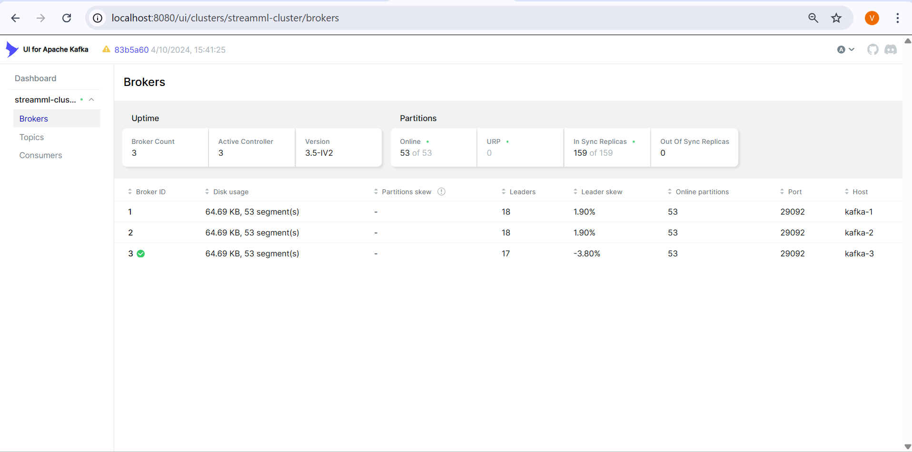
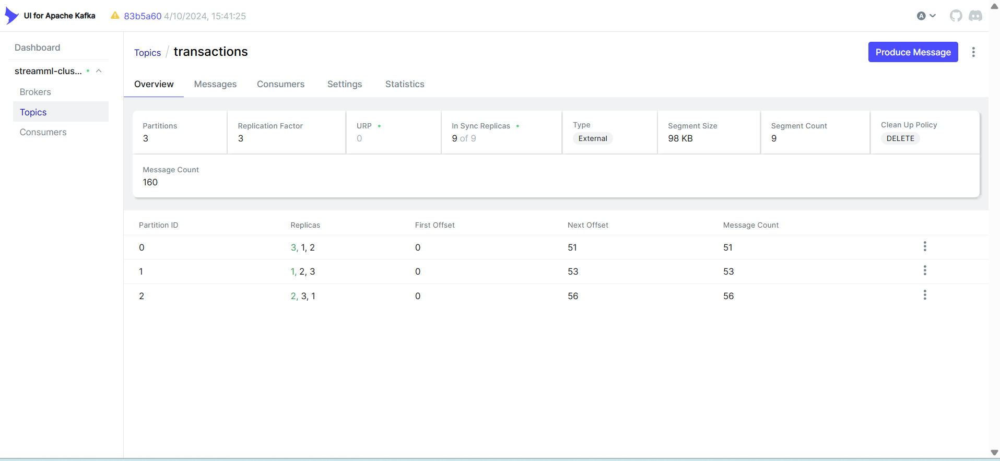
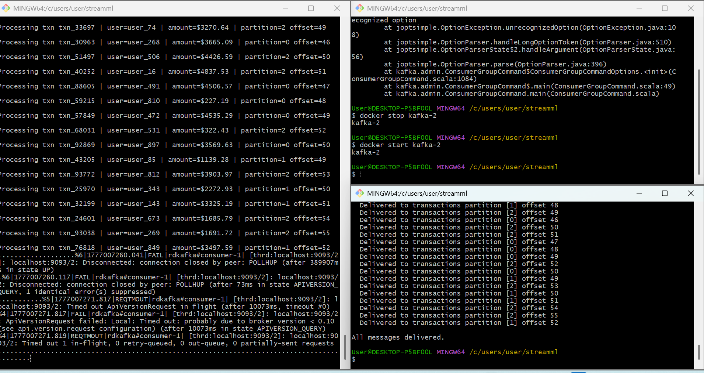
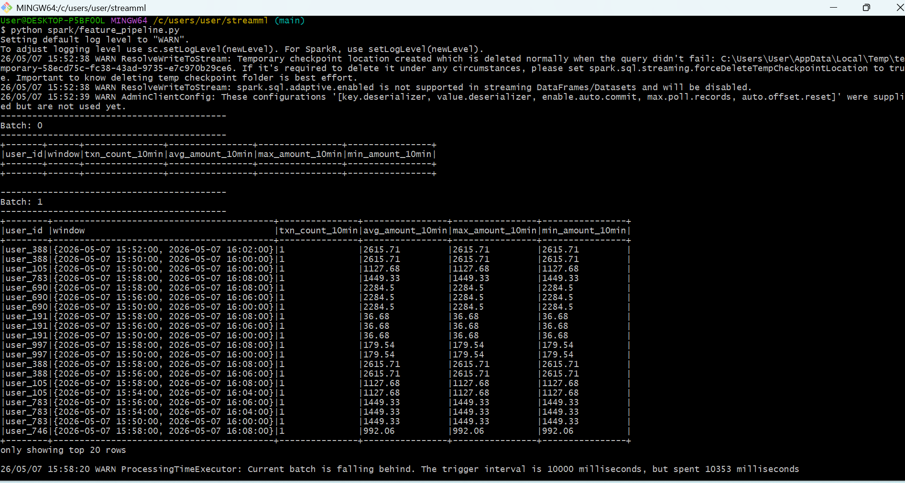
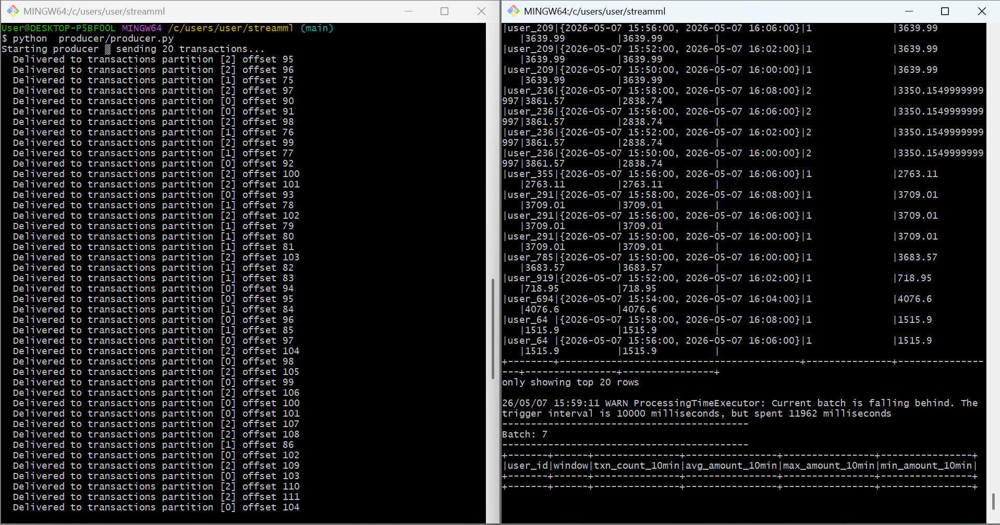
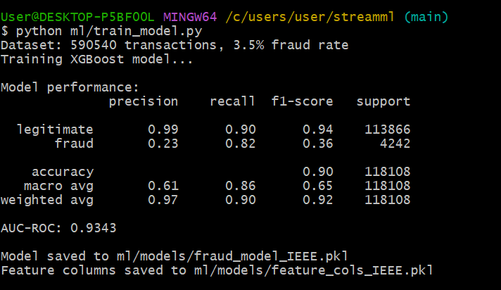
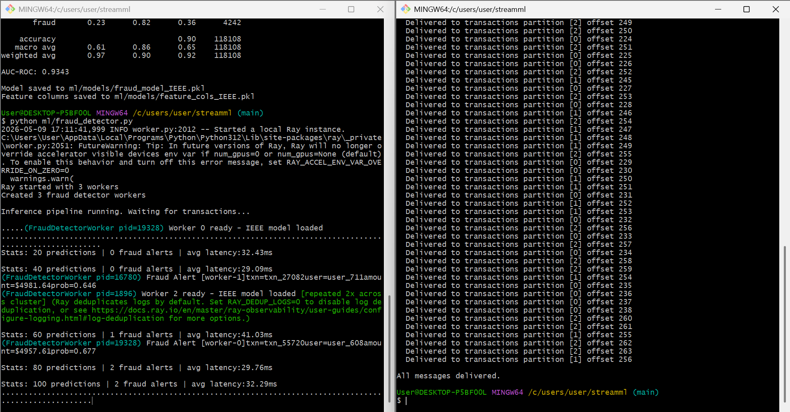
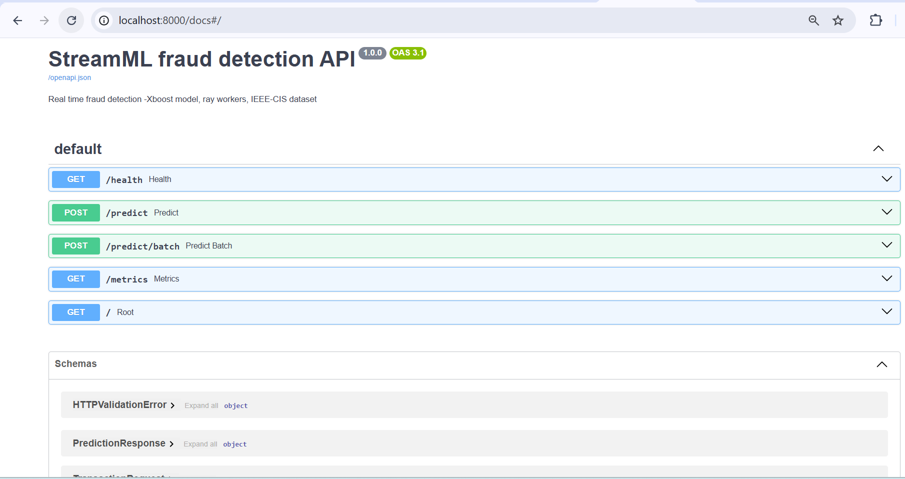
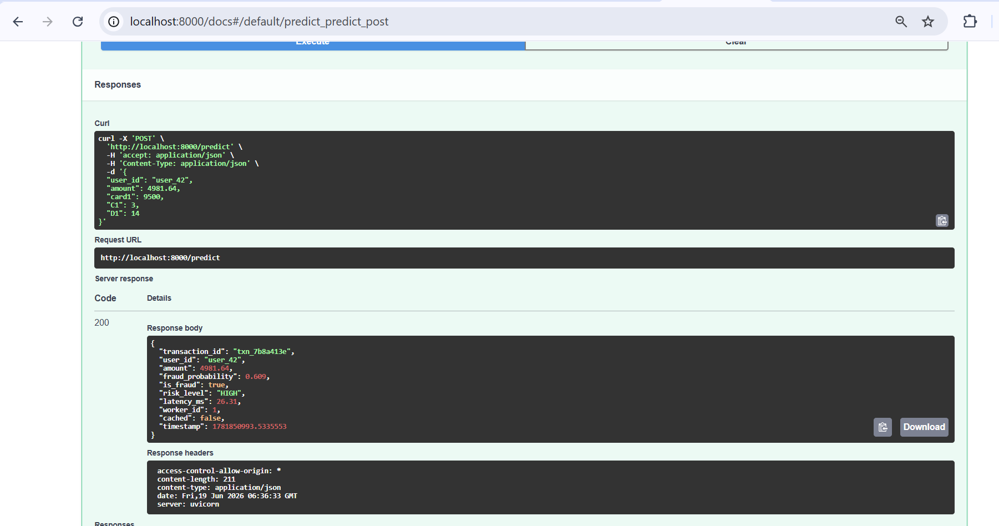
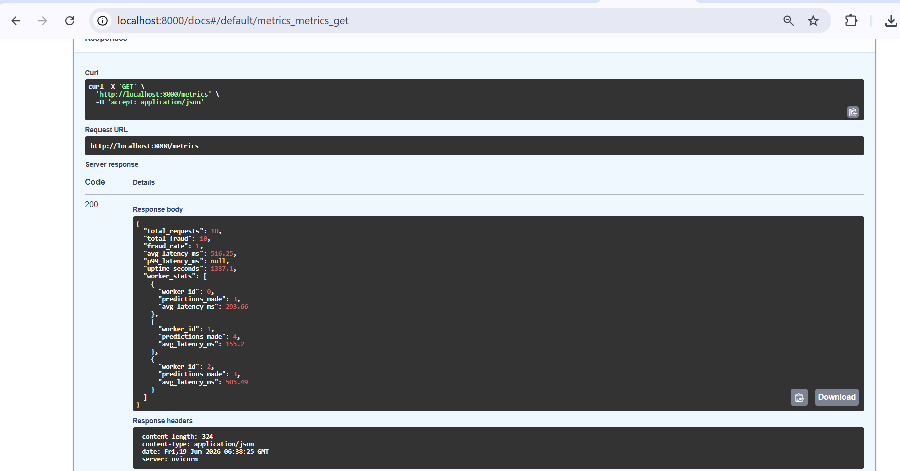

# StreamML — Distributed ML Inference Platform

> Real-time fraud detection pipeline built on distributed systems principles.
> Target: 50k predictions/sec | <10ms p99 latency | <15s node recovery

## Architecture
```
[Producer] → [Kafka: 3 brokers] → [Consumer Workers]
↓
[ML Inference] 
↓
[FastAPI + Monitoring] 
```

## Stack
- **Messaging:** Apache Kafka (KRaft mode, 3 brokers)
- **Workers:** Python confluent-kafka (Phase 2) → Ray (Phase 4)
- **Pipeline:** Apache Spark Streaming (Phase 3)
- **API:** FastAPI + Nginx (Phase 5)
- **Monitoring:** Prometheus + Grafana (Phase 6)
- **Deployment:** Docker Compose → Kubernetes (Phase 7-8)

## Phases
- [x] Phase 1 — Parallelism & concurrency fundamentals
- [x] Phase 2 — 3-broker Kafka cluster with fault tolerance
- [x]  Phase 3 — Spark streaming feature pipeline
- [x] Phase 4 — Ray distributed ML workers
- [ ] Phase 5 — FastAPI + load balancer
- [ ] Phase 6 — Prometheus + Grafana monitoring
- [ ] Phase 7 — Kubernetes deployment

## Phase 2 — What was built
- 3-broker Kafka cluster in KRaft mode (no ZooKeeper)
- Topic: `transactions` — 3 partitions, replication factor 3
- Producer: generates synthetic fraud detection events, keys by `user_id`
- Consumer: `ml-inference-group`, manual offset commit, fault isolated
- **Fault tolerance demo:** killed broker mid-stream, zero message loss,
  automatic leader re-election, recovery under 15 seconds

## Fault Tolerance Numbers
| Scenario | Result |
|---|---|
| Kill 1 of 3 brokers mid-stream | Zero message loss |
| Broker recovery time | < 15 seconds |
| Min brokers needed for writes | 2 of 3 (MIN_INSYNC_REPLICAS) |

## Screenshots

### Kafka Cluster — 3 brokers, 159/159 in-sync replicas


### Topic: transactions — 3 partitions, replication factor 3


### Fault tolerance — broker killed mid-stream, zero message loss


## Phase 3 — What was built
- Spark Structured Streaming pipeline consuming Kafka `transactions` topic
- Windowed feature computation: 10-minute sliding window, 2-minute slide
- Features computed per user: `txn_count_10min`, `avg_amount_10min`, `max_amount_10min`, `min_amount_10min`
- Fraud signal identified: users with high txn_count + high avg_amount in short windows
- Runs locally with `local[*]` master using manually downloaded Kafka connector JARs

## Phase 3 Screenshots

### Spark computing user features from live Kafka stream


### Producer + Spark pipeline running side by side


## Phase 4 — What was built
- 3 Ray actor workers, each loading XGBoost fraud model once into RAM
- Real dataset: 590,540 IEEE-CIS transactions, 3.5% fraud rate
- **Model upgraded:** Random Forest → XGBoost with feature engineering
- 35 features including time encoding, log transforms, card metadata
- **AUC-ROC: 0.9343** | Recall: 0.82 | Precision: 0.23
- Avg inference latency: 29-41ms on laptop
- Fault tolerance: worker crash detected, Kafka offset uncommitted, auto-reprocessed
- FRAUD ALERT triggered for transactions with fraud_probability > 0.5

## Phase 4 — Model Improvement Journey
| Version | Model | Features | AUC-ROC | Recall |
|---|---|---|---|---|
| v1 | Random Forest | 15 raw | 0.8805 | 0.30 |
| v2 | Random Forest + balanced | 15 raw | 0.8923 | 0.69 |
| v3 | XGBoost + engineering | 35 features | 0.9343 | 0.82 |

## Phase 4 Numbers
| Metric | Value |
|---|---|
| Training dataset | 590,540 real transactions |
| Fraud rate | 3.5% |
| AUC-ROC | 0.9343 |
| Recall (fraud) | 0.82 |
| Ray workers | 3 actors |
| Avg latency (laptop) | ~30ms |
| Model load strategy | Once per actor at startup |

## Phase 4 Screenshots

### XGBoost model performance — AUC 0.9343


### Ray workers + producer — fraud alerts in real time


## Phase 5 — What was built
- FastAPI serving layer with 3 endpoints: `/predict`, `/predict/batch`, `/metrics`
- Ray workers serve XGBoost model via HTTP — no script needed, just a POST request
- Redis caching — repeated transactions return cached result instantly
- Background Kafka logging — every prediction logged asynchronously without blocking response
- Risk scoring: LOW / MEDIUM / HIGH / CRITICAL based on fraud probability
- Auto-generated interactive API docs at `/docs`

## Phase 5 — Live Prediction Example
```json
POST /predict
{
  "user_id": "user_42",
  "amount": 4981.64,
  "card1": 9500,
  "C1": 3,
  "D1": 14


Response:
{
  "fraud_probability": 0.5419,
  "is_fraud": true,
  "risk_level": "HIGH",
  "latency_ms": 732.96,
  "worker_id": 1,
  "cached": false
}
```

## Phase 5 Screenshots

### Interactive API docs — auto-generated by FastAPI


### Live fraud prediction — HIGH risk detected


### Real-time metrics endpoint



## Running Locally
```bash
# Start Kafka cluster
docker compose up -d

# Terminal 1 — consumer
python consumer/consumer.py

# Terminal 2 — producer
python producer/producer.py

# Kafka UI
open http://localhost:8080
```


## Project Structure
```
streamml/
├── docker-compose.yml      # 3-broker Kafka + UI
├── producer/
│   └── producer.py         # Transaction event generator
├── consumer/
│   └── consumer.py         # Fault-isolated consumer
├── spark/
│   └── feature_pipeline.py
├── ml/
│   ├── fraud_detector.py
│   ├── train_model.py
│   ├── train_modelSYN.py
│   └── models/
├── jars/
└── docs/
    ├── TROUBLESHOOTING.md
    └── screenshots/
└── README.md
```    


